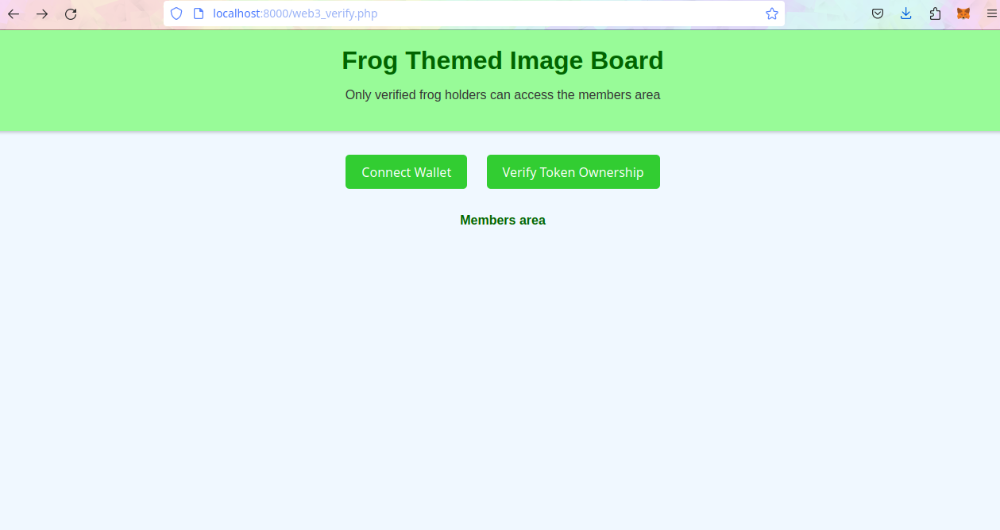

# Vichan-web3-tokengate
This repo provides the library files needed for token gating posting on any vichan install. 
  

  


I just fineshed the code. I will upload better instructions later 


## How to use this?


The vichan_web3_verify.php file is the main library for this project. In this file you can change the url for the https://github.com/web3NOSTR/TokenGateService-Lite instance  instance. 

once that change is made you can copy that file to your "inc" folder in your vichan install. 


Once the file is added to the vichan install you can then use the library from any php file like so:


```
<?php
// Include the token verification library
require_once 'inc/vichan_web3_verify.php';

// Check if the user is a verified holder
if (isVerifiedHolder()) {
    echo "Access granted, you are a verified holder.";
} else {
    echo "Access denied, please verify token ownership.";
}
?>

```

## using it to enforce verification for posting 

To enforce posting you need to make some changes to the post.php file inside your vichan install. 


## Debugging 

You can debug by uising the testing.php file. Run it cli with 
php -S localhost:8000

then you can access http://localhost:8000/web3_verify.php in a webrowser to test out a verify page


## Requirements 

curl must be installed (phpcurl)

sudo apt-get install php-curl

